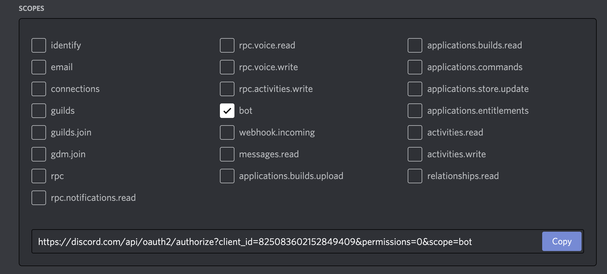
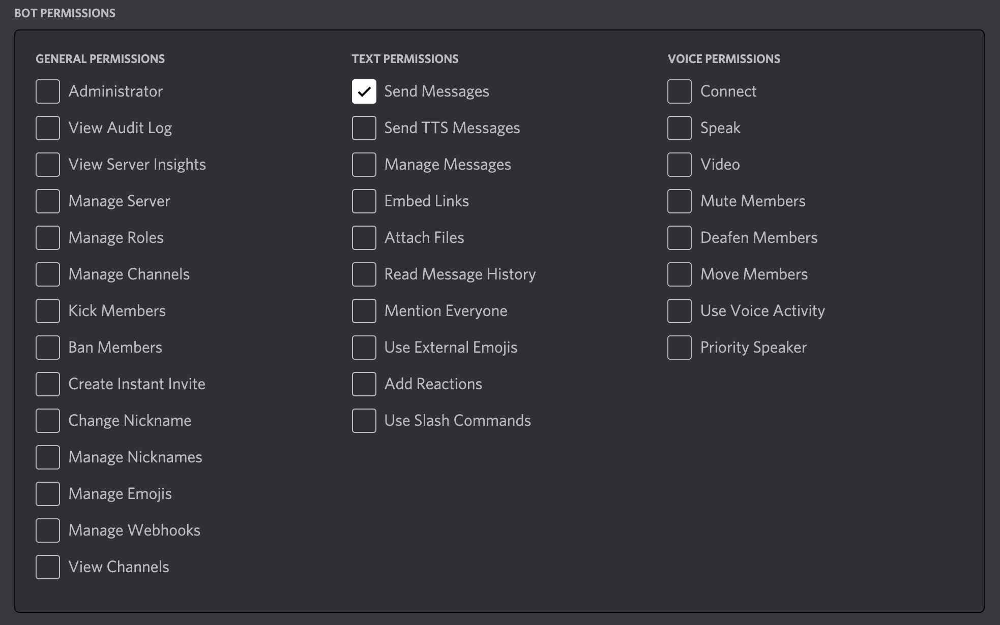

# Discord Bot to work for Polygon NFTs on OpenSea

This code is strongly based off of sbauch's https://github.com/sbauch/opensea-discord-bot, I tweaked it slightly to accomodate for Polygon NFTs and that the OpenSea API now needs an API key which you can request here: https://docs.opensea.io/reference/request-an-api-key

Enjoy!
--Below is the README that sbauch orignaly wrote to help you get it running.

## Prerequisites

This script can easily be deployed to Heroku and run on a job schedule, so you'll need a free Heroku account from https://heroku.com. The script can be run locally or from any server that offers a NodeJS runtime.

You'll also need a Discord bot who has the ability to post in a channel in your Discord server.

First, you need a Discord server where you have permission to add a Bot. It's free and easy to create your own Discord server.

Once you have a server you can use, grab the channel ID following the instructions at this Discord support article. You'll enable developer mode, which will allow you to easily copy the channel ID from the Discord app - https://support.discord.com/hc/en-us/articles/206346498-Where-can-I-find-my-User-Server-Message-ID-.

Next, create a New Application on the Discord developer portal by clicking the button in the top right corner at https://discord.com/developers/applications.

Give your application a name.

Click into the Bot menu item. You can name your bot and give it an avatar, but the only requirement is that you copy the Bot token:


Click into the OAuth2 menu item. Give your application the bot scope:



Then, in the next section, give your bot the Send Messages permission under Text Permissions:



Now you're ready to authenticate your bot to your server - copy the OAuth URL from the scopes box and open it in your browser. You'll be asked to give permission to the bot to enter your server.

Once the bot is in your server, ensure you have the following two values and you are ready to deploy or run your script:

- **botToken** i.e `SBI1MDI0NzUyNDQ3NzgyOTEz.YF36LQ.Sw-rczOfalK0lVzuW8vBjjcnsy0`
- **channelId** i.e. `814900494928445450`

## Run locally

You can run this script locally by pulling the repo to your local machine.

First, install the dependencies with `npm` or `yarn`.

Then copy the `.env.example` file to `.env` and replace the example values with your own.

```
$ yarn ts-node ./checkSales.ts
// or
$ ts-node ./checkSales.ts
```

## Deploy to Heroku

The easiest way to run this script on a chron scheduler is to deploy it to Heroku with this button:

[](https://heroku.com/deploy)

Heroku will require that you input the ENV vars that are necessary to run the script, and will run the `checkSales.ts` script after a successful deploy.

The `scheduler` add-on is included in the `app.json` but **you still must schedule the script to run** and we recommend running it hourly. This way the script will run every hour and will check the OpenSea API for sales in the last hour.

To set up the script to run on a schedule, once your Heroku app finishes deploying, click "Manage App", and then navigate to the Heroku Scheduler addon. Create a new job, run it every, and enter

```bash
yarn ts-node checkSales.ts
```

as the Run Command.
# polygon-opensea-discord-sales-bot
